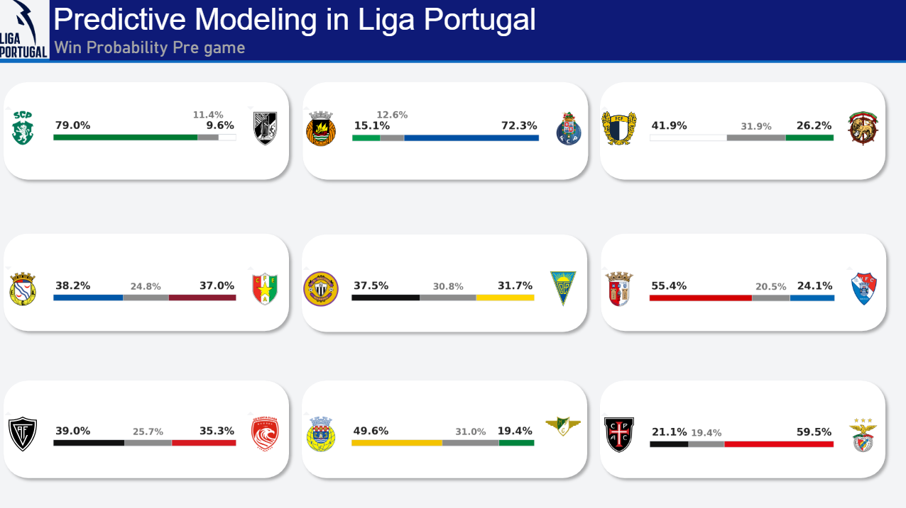

# Predictive Modeling in Liga Portugal ⚽📊

Source code repository and data processing pipeline designed to predict Portuguese Primeira Liga match outcomes using XGBoost.

> **Note:** For a detailed breakdown of the methodology, ablation study, and complete discussion of the statistical results, please refer to the full report available in the `documents/` folder.

---

## 🛠️ Repository Structure

The project directory and file structure are organized as follows:

```text
📦 PEC
 ┣ 📂 data
 ┃ ┣ 📂 processed       # Datasets after Feature Engineering
 ┃ ┗ 📂 raw             # Original historical datasets in CSV format
 ┣ 📂 documents         # Project documentation and academic reports
 ┣ 📂 figures
 ┃ ┣ 📂 2classes        # Binary model plots (Confusion Matrices, Calibration plots, etc.)
 ┃ ┗ 📂 3classes        # Multiclass model plots
 ┣ 📂 notebooks         # Jupyter Notebooks containing experiments, EDA, and model training
 ┣ 📂 scripts           # Python modules and helper functions called by main.py
 ┣ 📜 .env.example      # Environment variables configuration template (API Key)
 ┣ 📜 .gitignore        # Files and directories ignored by Git
 ┣ 📜 main.py           # Main script to execute the entire data pipeline
 ┣ 📜 last_matchday.txt # File containing the extracted probabilities from the last matchday of 25/26
 ┣ 📜 README.md         # Repository documentation
 ┗ 📜 requirements.txt  # Project dependencies and required Python libraries
```
---
## 🛠️ Built With

This project integrates a full data science pipeline, from data extraction to visualization:
* **Machine Learning:** XGBoost, Scikit-learn
* **Hyperparameter Optimization:** Optuna
* **Data Manipulation & Analysis:** pandas, NumPy
* **Visualization:** Power BI (Custom Python Visuals), Matplotlib, Seaborn
---
## 🧠 The Machine Learning Pipeline

The core of this project relies on predicting the probabilities of Home Win, Draw, and Away Win (1X2 market). The pipeline includes:
1. **Feature Engineering:** Calculation of rolling averages, goal differentials, and recent form metrics to capture team momentum.
2. **Hyperparameter Tuning:** Automated search for the optimal tree depth, learning rate, and regularization parameters using Optuna.
3. **Evaluation:** The models are evaluated using Log Loss and Brier Score, with detailed calibration plots available in the `figures/` directory.

---
## ⚙️ Setup and Installation

### 1. Clone the Repository and Install Dependencies
Make sure you have Python 3.x installed. Open your terminal, clone the project, and install the required libraries:

```bash
git clone ...
cd ...
pip install -r requirements.txt
```

### 2. Configure the API Key
To automate the extraction of upcoming matchdays, the project integrates with the official [football-data.org](https://www.football-data.org/).

1. Create an account on the platform to obtain a free access token.
2. Configure your environment file in the root directory. You can do this in two ways:
   * **Graphical Interface (VS Code / Windows):** Directly rename the `.env.example` file to `.env`.
   * **Terminal:** Copy the template by running the command `cp .env.example .env`.
3. Open the `.env` file and insert your API key:
   ```env
   FOOTBALL_API_KEY=insert_your_api_token_here
   ```

---

## 🏃 How to Run

### Main Pipeline
The entry point of the entire project is the `main.py` file. This script orchestrates data extraction (via API), data preprocessing, and prediction generation.

> 💡 **Execution Tip:** The ideal time to run this script is **one day before the matchday begins**. This ensures that the historical results from the previous week are fully finalized, allowing team form metrics (*rolling windows* and goal differentials) to be calculated with maximum accuracy before generating new predictions.

To run the complete pipeline:
```bash
python main.py
```

### Interactive Exploration
If you want to analyze the code step-by-step, train models individually, or regenerate the plots inside the `figures/` folder, you should use the file `pregame_test.ipynb` within the `notebooks/` folder.

---
## 📊 Data Visualization

To consume the model's predictions in a clean, production-ready environment, a custom Power BI dashboard was built. It dynamically reads the generated probabilities and renders TV-broadcast-style horizontal bars using embedded Python scripts.


*(Example: Matchday predictions displaying win/draw/loss probabilities with dynamically adjusted, collision-free text markers).*
---

## 🔄 Maintenance: Transitioning to New Seasons

The project is currently configured for the *2026/2027* season. If you wish to update the model for the following season (e.g., 2027/2028), you will need to update two variables inside the `scripts/update_data.py` script and one variable inside the `scripts/future_matches.py` script:

1. **API URL:** Update the season year in the *football-data* URL.
   From: `https://www.football-data.co.uk/mmz4281/2627/P1.csv`
   To: `https://www.football-data.co.uk/mmz4281/2728/P1.csv`
2. **Local Path:** Update the file name for the new season.
   From: `file_path = Path("data/raw/LigaPortugal26-27.csv")`
   To: `file_path = Path("data/raw/LigaPortugal27-28.csv")`

When you execute the script, it will automatically detect that it is a new season and create the new base file autonomously.